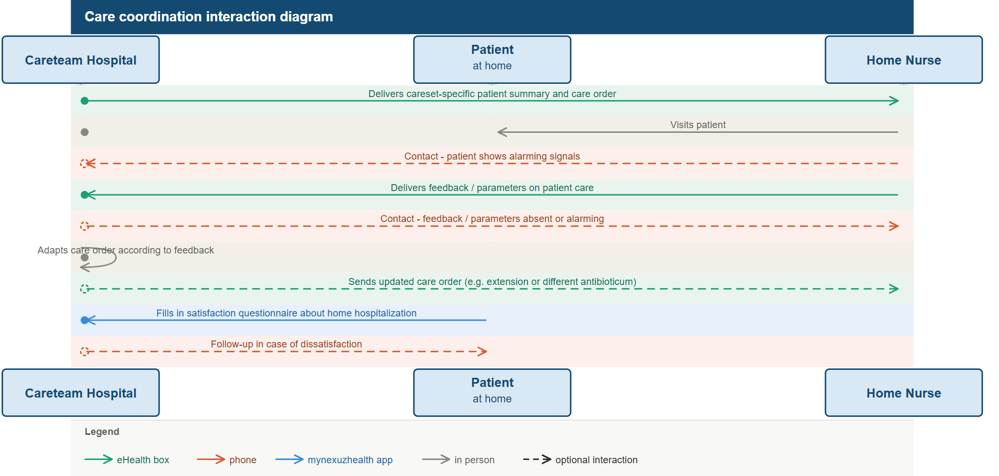

# Special careset - home hospitalization - Patient Monitoring Outcome FHIR Implementation Guide v0.1.0

## Special careset - home hospitalization

### Introduction: What is home hospitalization?

Home hospitalization (also known as **hospital-at-home**) allows patients to receive complex medical treatments - traditionally reserved for an inpatient setting - within the comfort of their own homes.

#### Why is it important?

* **Patient well-being:** Enhances quality of life and reduces the psychological strain of long hospital stays.
* **Reduced risk:** Minimizes exposure to hospital-acquired infections (nosocomial infections).
* **Efficiency:** Frees up hospital beds for acute cases while maintaining high-quality clinical oversight.

### Legal necessity and compliance

As of **July 1, 2023**, home hospitalization in Belgium is a strictly regulated medical activity. The law mandates that the hospital remains the **central director** (regisseur) of the care.

Healthcare providers must understand that moving the patient to a home setting does not transfer the hospital’s liability. Specific protocols regarding medication monitoring, nurse presence, and digital reporting are now **legally required** to ensure patient safety and qualify for reimbursement.

### Core Legal Pillars & Mandatory References

To ensure compliance, all stakeholders must adhere to the regulations provided by the following three pillars:

#### Financial and Clinical Framework (RIZIV/INAMI)

The National Institute for Health and Disability Insurance (RIZIV) defines which treatments are eligible and how the coordination between the hospital and the patient must be structured.

* **Key Requirement:** The hospital medical specialist remains legally responsible for the treatment plan and must coordinate with the patient’s GP.
* **Source (web):** [RIZIV - Home Hospitalization for Oncology and Antimicrobial Treatment](https://www.riziv.fgov.be/nl/thema-s/verzorging-kosten-en-terugbetaling/wat-het-ziekenfonds-terugbetaalt/thuishospitalisatie-voor-oncologie-en-antimicrobiele-behandeling)
* **Reference (PDF):** [Fourth amendment to the 2019 national agreement between Belgian hospitals and insurance institutions, which establishes the regulatory and financial framework for home hospitalization (NL)](2023-03-07_ZH_2020_quinquies_voorOCZH.pdf)

#### Medication Safety and Logistics (FAGG/AFMPS)

The Federal Agency for Medicines and Health Products (FAGG) regulates the “pharmaceutical chain” and the specific substances allowed for home administration.

* **Key Requirement:** The hospital pharmacist is legally responsible for the preparation, transport, and stability of the medication. Only medications on the approved FAGG list may be used.
* **Source:** [FAGG - Home Hospitalization Guidelines and Drug Lists](https://www.fagg.be/nl/menselijk_gebruik/geneesmiddelen/geneesmiddelen/distributie_aflevering/thuishospitalisatie)

#### Operational Coordination (RIZIV Circular / Omzendbrief)

The “Omzendbrief” (Circular) provides the technical instructions that hospitals must follow to execute the law, specifically regarding the partnership with home nurses.

* **Key Requirement:** A written agreement must exist between the hospital and external providers. The hospital must provide a 24/7 point of contact for the home nurse.
* **Source:** [RIZIV Circular - Administrative and Operational Conditions (docx)](https://www.riziv.fgov.be/SiteCollectionDocuments/omzendbrief_ziekenhuizen_2023_09.docx)

> **Legal Disclaimer:** This template serves as an informative guide. For specific medical-legal disputes, always consult the full text of the **Royal Decree of June 22, 2023**, published in the Belgian Official Gazette.

### Specific care paths & automated EHR integration

In multiple hospitals and 1st line organizations this home hospitalization framework has been technically implemented for the two most common care paths: OPAT (Outpatient Parenteral Antimicrobial Therapy) and Antitumoral Therapy (Oncology). This technical implementation made sure the clinical flows for both the hospital and 1st line are fully automated and both parties can work in their own EHR. This ensures real-time data exchange between the hospital and 1st-line providers (home nurses/GPs).

See [OPAT Careset](./home-hospitalization-opat.md) and [Antitumoral Careset](./home-hospitalization-antitumoral.md) for more information about this technical implementation.

